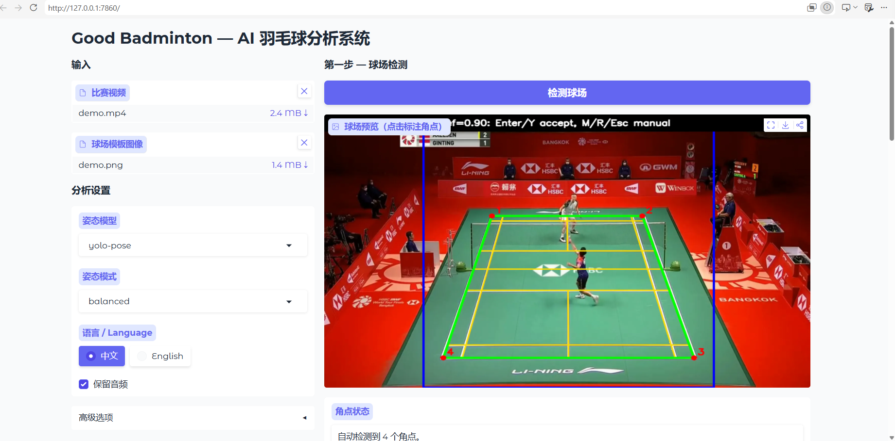
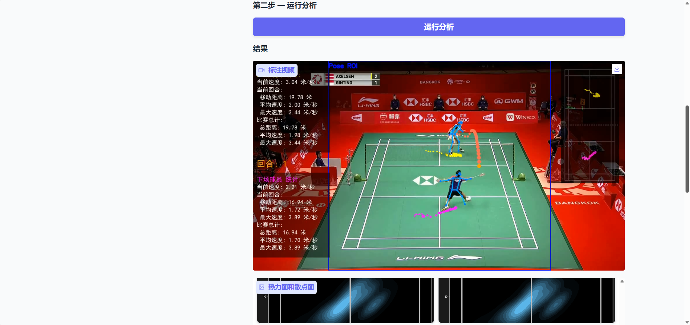

# Good-Badminton: AI 羽毛球鹰眼系统 🏸

<div align="center">

[](https://github.com/yo-WASSUP/Good-Badminton/stargazers)
[](https://github.com/yo-WASSUP/Good-Badminton/network/members)
[](https://github.com/yo-WASSUP/Good-Badminton/blob/main/LICENSE)
[](https://www.xiaohongshu.com/explore/6a37b1d20000000011016229?xsec_token=ABod3wXBTiDppp6W2Ou0QHlu2eotUkeu27-ha64nFRR74=&xsec_source=pc_user)

**基于计算机视觉的羽毛球比赛视频分析工具**

当前比赛/移动端主后端：`backend_api.py`，端口 `8001`。

</div>

## 当前项目文档

| 文档 | 用途 |
| --- | --- |
| [00_FRONTEND_HANDOFF.md](00_FRONTEND_HANDOFF.md) | 给前端同学的总交接说明 |
| [01_MOBILE_BACKEND.md](01_MOBILE_BACKEND.md) | 移动后端启动与接口概览 |
| [02_FRONTEND_API.md](02_FRONTEND_API.md) | 移动端接口字段、响应、错误码 |
| [03_FRONTEND_API_CHANGELOG.md](03_FRONTEND_API_CHANGELOG.md) | 接口变更记录 |
| [04_MOBILE_FRONTEND.md](04_MOBILE_FRONTEND.md) | 浏览器测试前端说明 |
| [05_NETWORK_DEPLOYMENT.md](05_NETWORK_DEPLOYMENT.md) | 同 WiFi、内网穿透、公网 baseUrl 配置 |
| [06_CORNER_PICKER_HANDOFF.md](06_CORNER_PICKER_HANDOFF.md) | 手机点选四角点的前后端协议 |
| [07_COACHING_ADVICE.md](07_COACHING_ADVICE.md) | 结构化训练建议与知识库说明 |
| [mobile_app/README.md](mobile_app/README.md) | Flutter/Android App 构建与安装 |

## 🎬 效果预览


## 🆕 更新日志

- **2026-06-27**：优化自动球场线检测,减少误匹配。
- **2026-06-24**：新增 Gradio WebUI，支持浏览器操作 - From KangweiLIAO PR。
- **2026-06-23**：增加自动球场边界检测。
- **2026-06-20**：正式开源。
- **2026-06-17**：整理项目介绍文档。
- **当前版本**：支持球员姿态检测、羽毛球检测、球场坐标映射、轨迹统计、热力图/散点图和带标注视频输出。
- **实验功能**：击球点分析和技术动作统计仍在迭代中，适合研究和二次开发使用。

## 🔮 开发计划

- [x] 羽毛球比赛视频逐帧分析
- [x] RTMPose / RTMO / YOLO Pose 多姿态模型支持
- [x] YOLO 羽毛球检测模型接入
- [x] 手动球场标注与球场坐标映射
- [x] 球员移动轨迹、速度、距离和回合统计
- [x] 中文 / 英文可视化文字
- [x] 热力图、散点图和检测数据导出
- [ ] 更稳定的击球点识别
- [ ] 更精确的羽毛球检测模型
- [ ] 更完整的技术动作统计
- [x] 自动球场关键点检测
- [x] Gradio WebUI（浏览器操作，无需命令行）
- [ ] 批量视频分析工作流

---

## ✨ 功能

- **球员姿态检测** - 支持 RTMPose、RTMO 和 Ultralytics YOLO Pose，识别人体关键点和骨架。
- **羽毛球检测** - 使用 YOLO 模型检测羽毛球位置，并在输出视频中绘制轨迹。
- **球场坐标映射** - 手动标注球场关键点，将图像坐标映射到标准球场坐标。
- **自动球场检测** - 根据标准羽毛球场线模型匹配白/黄球场线，并支持在 WebUI 中手动修正四角点。
- **球员位置追踪** - 分别追踪上半场和下半场球员位置，记录移动轨迹。
- **回合检测** - 根据连续球场视图自动判断回合开始和结束，并在视频叠加层和检测数据中记录回合编号。
- **运动统计分析** - 统计移动距离、当前速度、最大速度和回合数量。
- **可视化输出** - 生成带骨架、轨迹、统计信息和球场轨迹的分析视频。
- **位置图表** - 自动生成球员位置热力图和散点图。
- **中英文显示** - 可通过 `--language zh/en` 切换可视化文字。
- **WebUI** - 提供基于 Gradio 的浏览器界面，无需命令行即可完成视频上传、球场检测、参数配置和结果查看。
- **本地运行** - 视频、模型和分析结果都保存在本地。

## 📋 系统要求

- Python 3.8+
- FFmpeg，并已加入系统 `PATH`
- 羽毛球 YOLO 检测权重，请从 [GitHub Releases](https://github.com/yo-WASSUP/Good-Badminton/releases/latest)  下载

## 性能需求与参考速度

推荐配置：

- GPU，建议 6GB+ 显存；显存越大，越适合更高分辨率视频和更大的姿态模型。
- 16GB+ 系统内存。
- SSD 存储，方便写入输出视频、`detections.jsonl` 和可视化图片。
- CPU 可以运行完整流程，但姿态检测和羽毛球检测会明显变慢，更适合短视频或功能验证。

参考速度会受显卡、视频分辨率、姿态模型、是否显示窗口、是否保留音频影响。

以 720p 视频、`--pose-family yolo-pose --yolo-pose-model yolo11n-pose.pt` 和 `weights/yolo11s-ball.pt` 为例，GPU 推理日志通常接近：

```text
pose 0.02s, shuttlecock 0.02s, shuttle draw 0.00s, players draw 0.01s, court draw 0.00s
```

开启 `--performance-stats` 可以每隔约 5 秒打印一次性能汇总，用于判断瓶颈在姿态推理、羽毛球检测还是绘制阶段。

## 🚀 安装指南

默认依赖使用 CPU 版 PyTorch 和 ONNX Runtime。

### Windows

```bash
python -m venv .venv
.\.venv\Scripts\activate
python -m pip install --upgrade pip
pip install -r requirements.txt
```

### Linux / macOS

```bash
python -m venv .venv
source .venv/bin/activate
python -m pip install --upgrade pip
pip install -r requirements.txt
```

### GPU 加速（Windows / NVIDIA）

前置要求：

- 已安装 NVIDIA 显卡驱动，`nvidia-smi` 可以正常输出显卡信息。
- 推荐使用 CUDA 12.1 对应的 PyTorch wheel。

PowerShell：

```bash
.\.venv\Scripts\activate

pip uninstall -y torch torchvision onnxruntime onnxruntime-gpu
pip install torch==2.5.1+cu121 torchvision==0.20.1+cu121 --index-url https://download.pytorch.org/whl/cu121
pip install onnxruntime-gpu==1.20.1
```

验证 GPU 是否生效：

```bash
python -c "import torch; print('torch:', torch.__version__); print('cuda:', torch.cuda.is_available()); print('gpu:', torch.cuda.get_device_name(0) if torch.cuda.is_available() else 'not available')"
python -c "import onnxruntime as ort; print(ort.__version__); print(ort.get_available_providers())"
```

期望看到：

```text
cuda: True
CUDAExecutionProvider
```

> 注意：安装 GPU 版 ONNX Runtime 后，`pip check` 可能提示 `rtmlib requires onnxruntime, which is not installed`。只要 provider 验证能看到 `CUDAExecutionProvider`，就不要再安装 CPU 版 `onnxruntime`，否则可能覆盖 GPU 包。

切回 CPU 版：

```bash
pip install --force-reinstall -r requirements.txt
```

### WebUI 安装（可选）

WebUI 基于 Gradio，需要额外安装依赖：

```bash
pip install -r requirements-webui.txt
```

启动 WebUI：

```bash
python -m webui.app
```

浏览器打开终端输出的地址（默认 `http://127.0.0.1:7860`），即可使用：

1. 上传比赛视频和球场模板图。
2. 点击"检测球场"，自动检测球场边界。如果需要修正，可以直接在图片上点击 4 个角点后点击"应用手动角点"。
3. 调整分析参数（姿态模型、语言、可视化选项等）。
4. 点击"运行分析"，等待进度条完成后查看标注视频、热力图/散点图和检测数据。

| 球场检测与参数配置 | 分析结果查看 |
| --- | --- |
|  |  |

WebUI 是可选功能，CLI 命令行方式不受影响。

## 📝 使用指南

### 第一次运行流程（CLI）

1. 准备输入视频和羽毛球检测权重。
2. 运行基础命令：

```bash
python main.py --video-path videos/demo.mp4
```

3. 如果没有传 `--template-path`，程序会弹出文件选择框，让你选择一张球场模板图。模板图通常选视频里视角稳定、球场线清楚的一帧。
4. 程序会先尝试自动检测球场边界，并保存 `outputs/<视频文件名>/auto_court_preview.png`。预览窗口按 Enter/Y 接受自动结果；按 M/R/Esc 进入手动四角标注。
5. 如果进入手动标注，按图片顶部提示依次点击球场四个角点：左上、右上、右下、左下。


6. 点完四个点后，窗口会显示绿色球场框和蓝色姿态检测 ROI 框。ROI 由程序根据球场自动生成。
7. 标注结果会保存到 `outputs/<视频文件名>/court_annotations.txt`。同一个输出目录下再次运行会复用这个文件，不会重复要求标注。
8. 分析结束后，查看 `outputs/<视频文件名>/detect_<视频文件名>.mp4`、`detections.jsonl` 和 `position_visualizations/`。

为什么要标注球场四点：

- 四个角点用于建立图像坐标到标准羽毛球场坐标的映射。
- 球员过滤主要依赖球场坐标，能把观众、裁判、场外人员过滤掉。
- 上下半场球员判断、移动距离、速度、回合统计、热力图和散点图都依赖这个映射。
- 回合检测基于球场模板匹配：连续多帧识别为比赛视图时开始回合，连续多帧离开比赛视图时结束回合。
- 姿态检测 ROI 只用于减少推理区域和提升速度；它会自动从球场范围扩展生成。
- 羽毛球检测仍在整帧上执行，轨迹显示会按球场横向范围加 padding 做基础过滤。

如果你换了视频视角、裁切方式或模板图，需要删除对应输出目录里的 `court_annotations.txt`，重新标注四点。

### 姿态模型选择

```bash
# 默认：两阶段 RTMPose balanced
python main.py --video-path videos/demo.mp4 --pose-family rtmpose --pose-mode balanced

# 更轻量的一阶段 RTMO
python main.py --video-path videos/demo.mp4 --pose-family rtmo --pose-mode lightweight

# 使用 Ultralytics YOLO Pose
python main.py --video-path videos/demo.mp4 --pose-family yolo-pose --yolo-pose-model yolo11n-pose.pt
```

RTMPose 模型档位：

- `lightweight`：速度优先。
- `balanced`：默认配置，速度和效果折中。
- `performance`：更大模型，速度更慢，通常更适合追求检测质量。

### 常用参数

```text
--video-path                 输入视频路径，必填
--output-dir                 输出目录，默认 outputs/<视频文件名>
--ball-model                 YOLO 羽毛球检测模型路径，默认 weights/yolo11s-ball.pt
--pose-family                姿态模型族：rtmpose、rtmo 或 yolo-pose
--pose-mode                  RTMPose / RTMO 档位：lightweight、balanced、performance
--yolo-pose-model            YOLO pose 模型路径或模型名，默认 yolo11n-pose.pt
--template-path              球场模板图路径；不传时会弹出文件选择框
--pose-roi true|false                是否显示姿态检测 ROI 框，默认 true
--display true|false                 是否显示 OpenCV 预览窗口，默认 true
--skeletons true|false               是否显示人体骨架，默认 true
--player-trajectories true|false     是否显示球员轨迹，默认 true
--court-trajectory true|false        是否显示球场轨迹叠加层，默认 true
--shuttlecock-trajectory true|false  是否显示羽毛球轨迹，默认 true
--player-stats true|false            是否显示球员统计信息，默认 true
--performance-stats                  打印性能耗时
--save-images                        保存处理后的每帧图像
--visualize-positions true|false     是否生成热力图和散点图，默认 true
--audio true|false                   是否保留原视频音频，默认 true
--language {zh,en}           选择界面语言
```

## 📊 输出结果

默认输出到 `outputs/<视频文件名>/`：

- `metadata.json`：视频、模型、球场标注和输出文件元数据。
- `detections.jsonl`：逐帧检测记录，包含回合编号、球员、手部、球场坐标、速度和羽毛球坐标。
- `detect_<视频文件名>.mp4`：带骨架、轨迹、统计信息和回合编号叠加层的输出视频。
- `court_annotations.txt`：球场标注坐标缓存。
- `position_visualizations/heatmaps/`：球员位置热力图。
- `position_visualizations/scatter_plots/`：球员位置散点图。

### 位置可视化示例

| 热力图 | 散点图 |
| --- | --- |
|  |  |

## 🧩 项目结构

```text
main.py              # 命令行入口和参数解析，保持 python main.py ... 的运行方式
badminton_analysis/
├── system.py        # 视频分析主流程 BadmintonAnalysisSystem
├── court/           # 球场标注与坐标映射
├── data/            # JSON / JSONL 输出
├── detection/       # 羽毛球检测与姿态检测
├── media/           # 视频音频处理
├── tracking/        # 球员追踪
└── visualization/   # 视频叠加层、统计图和位置图
webui/
├── app.py           # Gradio WebUI 界面与启动入口
└── pipeline.py      # WebUI 分析流程编排
```

## 🙏 致谢

感谢 RTMPose、RTMO 和 OpenMMLab 生态提供的姿态估计算法基础，以及 [Tau-J/rtmlib](https://github.com/Tau-J/rtmlib) 提供的轻量姿态估计运行库。

感谢 [Ultralytics](https://github.com/ultralytics/ultralytics) 提供的 YOLO 目标检测算法与工具链。

感谢 [yastrebksv/TrackNet](https://github.com/yastrebksv/TrackNet) 项目整理并公开羽毛球数据集，为本项目的羽毛球检测与轨迹分析提供了重要参考。

## 📄 许可证

本项目代码和 `weights/yolo11s-ball.pt` 使用 Apache License 2.0。随 Release 提供的 RTMPose / RTMO / YOLOX ONNX 权重来自 OpenMMLab / RTMPose 生态，按其上游 Apache License 2.0 授权使用，并保留原始归属。

## Star History

[](https://www.star-history.com/#yo-WASSUP/Good-Badminton&Date)
